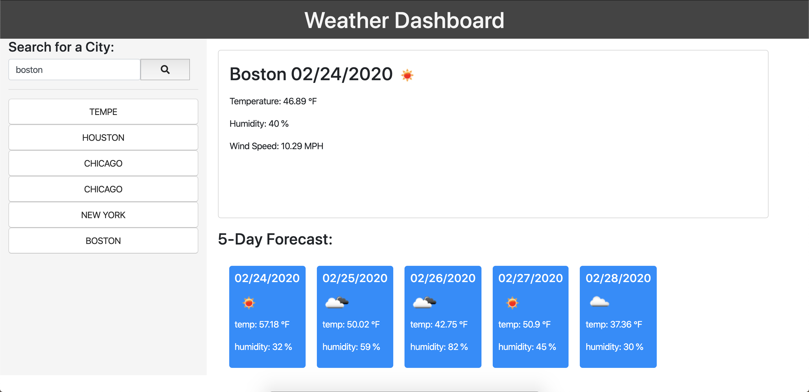

# Weather Dashboard

For this project I created a weather dashboard using [OpenWeather API KEY](https://openweathermap.org/api), one html file, one css file, and one javascript file. This is a dashboard that can keep all you rrecent city searches and display the citys weather along with the next 5 following days after. I used the [OpenWeather API KEY](https://openweathermap.org/api) to retrieve weather data for each of the cities and displayed the content through javascript.

## Dashboard Attributes
 
```
GIVEN a weather dashboard with form inputs
WHEN I search for a city
THEN I am presented with current and future conditions for that city and that city is added to the search history
WHEN I view current weather conditions for that city
THEN I am presented with the city name, the date, an icon representation of weather conditions, the temperature, the humidity, the wind speed, and the UV index
WHEN I view the UV index
THEN I am presented with a color that indicates whether the conditions are favorable, moderate, or severe
WHEN I view future weather conditions for that city
THEN I am presented with a 5-day forecast that displays the date, an icon representation of weather conditions, the temperature, and the humidity
WHEN I click on a city in the search history
THEN I am again presented with current and future conditions for that city
```

<br>

The following image demonstrates on the computer:



<br>

Lets check the weather!! 
 [Weather Dashboard](https://dorntrevor7.github.io/Weather-Dashboard/);
